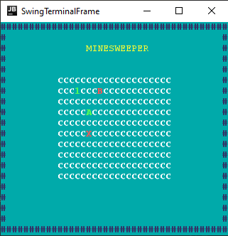
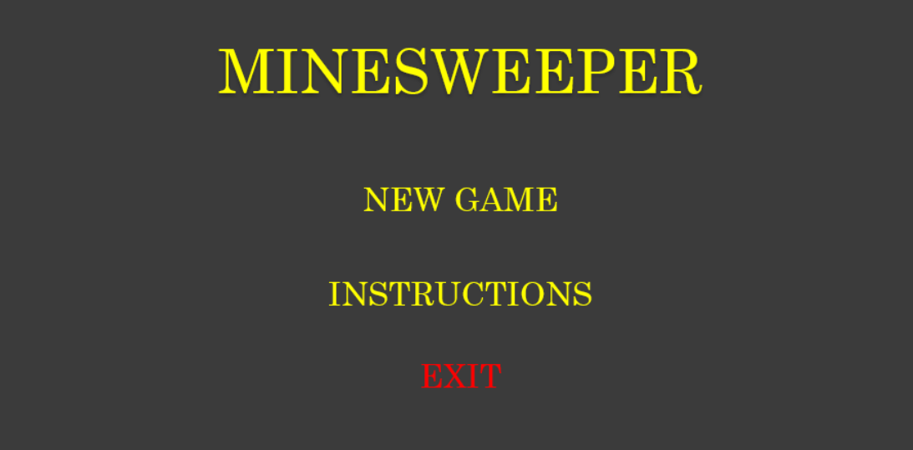
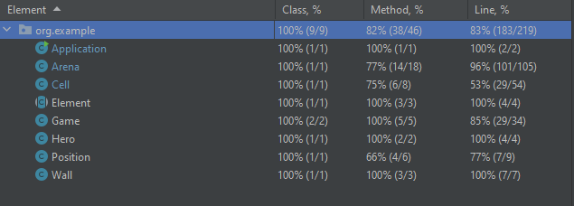

## LDTS_<07><03> - Minesweeper

**Descrição do jogo**:

Este projeto é baseado no clássico jogo Minesweeper. Durante o jogo o utilizador tem um cursor que o deixa escolher que célula quer revelar, cada célula ou tem uma bomba ou está vazia ou tem o número de bombas adjacentes.
O objetivo é revelar todas as células exceto as que contêm bombas. O jogo acaba quando uma célula que contem uma bomba é revelada pelo jogador, que perde o jogo, ou quando todas as células que não têm bombas já foram reveladas, levando à vitória do jogador. 

Projeto realizado por Daniel Carneiro (up202108832@fe.up.pt), Gonçalo Costa (up202108814@fe.up.pt) e Rodrigo Moucho (up2021088552@fe.up.pt) para LDTS 2022⁄23.

### FEATURES IMPLEMENTADAS

> Como o projeto ainda está num estado inicial, apenas foram implementas poucas features.

- **Move** - Para mover o cursor pelas várias células o jogador deve usar as arrow keys. Se o jogador tentar movimentar o cursor para fora das células não consegue porque é impedido.
- **Reveal** - A célula sobre a qual o cursor se encontra pode ser revelada utilizando a tecla enter.
- **Quit** - Para fechar o jogo o jogador pode clicar na tecla q.

**Imagens**:

Célula antes de ser revelada (C), depois de ser revelada estando vazia e sem bombas ao adjacentes (A), com bombas adjacentes (neste caso 1) e com bomba (B). Cursor (X).
### FEATURES PLANEADAS

- **Menu** - Menu inicial onde o jogador pode começar um novo jogo ou fechar o jogo.
- **Função para melhorar jogabilidade** - Função que, quando a célula que foi revelada está vazia e todas as adjacentes também estão vazias (todas as células quando revelados se transformam revelam um "A"), automaticamente revela-as a todas.
- **Perder** - Quando a célula revelada pelo jogador é uma bomba o jogador perde o jogo.
- **Ganhar** - Quando todas as células não reveladas são bombas o jogador ganha o jogo.
- **Flag** - Feature que permite ao utilizador colocar uma "flag" numa célula (normalmente utilisada pelo jogador para indicar que esta célula tem uma bomba).

Menu a implementar.
### DESIGN

#### Gerar a tabela de jogo

**Problema**

De forma a não sobrecarregar a classe Arena com demasiado código, cumprindo o Single Principle Responsability, criaremos uma classe Table para gerar todos os elementos a serem revelados, criamos a classe Cell para gerar todos as células de jogo e, na classe Arena, restará a revelação de cada célula ao clique do utilizador.

**Pattern**

Para isso, aplicaremos o Factory Pattern, de forma a criar um código mais claro e de mais fácil manutenção, cumprindo com os princípios SOLID.

**Implementação**

A ser implementado no futuro.

**Consequências**

- Código mais percetível e mais fácil de fazer manutenção ou alterações.
- Não existe quebra de princípios SOLID

#### Divisão dos elementos do programa / MVC

**Problema**

Separar os diferentes elementos do nosso código, de forma a tornar o código mais organizado, sem quebrar o Single Principle Responsability.

**Pattern**
O MVC separa o código em três parâmetros, Model, criação dos objetos do programa, View, cria a interface dos objetos e Control, controla o flow de informação dos objetos criados.

**Implementação**

A ser implementado no futuro: Criação de classes que irão separar estes items. (Exemplo Model – classe Table, View – classe Arena e Cell, Control – classe Game e certos métodos em Arena)

**Consequências**

- Maior facilidade em alterar as funcionalidades de cada contexto, sem interferir noutras funções.

#### Remoção de flags / Command

**Problema**

Remover uma flag, guardando a sua posição na Table de jogo e criando um método para retirá-la.

**Pattern**

Aplicaremos um Command pattern que nos permite guardar o comando de flag e as suas posições em estruturas de dados, para que mais tarde possamos retirá-la.
**Implementação**

A ser implementado no futuro.

**Consequências**

- Os comandos podem ser guardados em estruturas de dados.
- Facilidade em adicionar novos comandos.

#### CODE SMELLS E SUGESTÕES DE REFACTORING

**Comentários**:
- Idealmente deve ser escrito código que se explica a si próprio. No entanto, como o programa ainda está num estado inicial, certas funções estão demasiado longas ou não optimizadas e achamos necessário comentar certas partes do código.

**Long Method**: 
- Nomeadamente a função Cell.draw() e o Arena.generateBeeps() estão bastante longas apesar de, na nossa opinião, estarem percetíveis. No futuro iremos fazer refactoring deste código para o tornar mais conciso.

### TESTING

Código em estado inicial portanto testes são para já poucos e simples.

**Coverage**:

### Autoavaliação

Todos os elementos do grupo têm o mesmo nível de participação.

- Daniel Carneiro - 33%
- Gonçalo Costa - 33%
- Rodrigo Moucho - 33%
