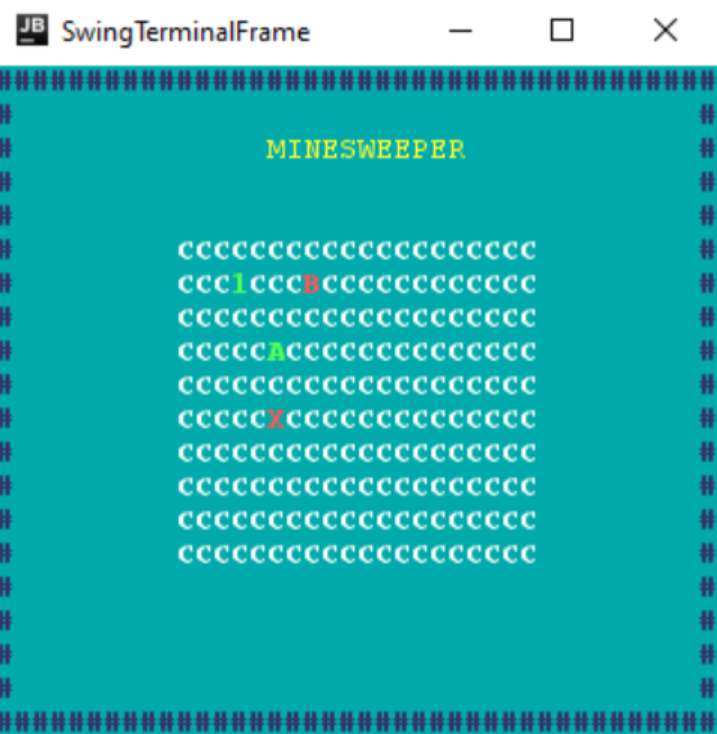

## LDTS_<07><03> - **Minesweeper**

Este projeto é baseado no clássico jogo Minesweeper. Durante o jogo o utilizador tem um cursor que o deixa escolher que célula quer revelar, cada célula ou tem uma bomba ou está vazia ou tem o número de bombas adjacentes.
O objetivo é revelar todas as células exceto as que contêm bombas. O jogo acaba quando uma célula que contem uma bomba é revelada pelo jogador, que perde o jogo, ou quando todas as células que não têm bombas já foram reveladas, levando à vitória do jogador. 

### CRÉDITOS

Projeto realizado por Daniel Carneiro (up202108832@fe.up.pt), Gonçalo Costa (up202108814@fe.up.pt) e Rodrigo Moucho (up2021088552fe.up.pt) para LDTS 2022⁄23.

### FEATURES IMPLEMENTADAS

- **Move** - Para mover o cursor pelas várias células o jogador deve usar as arrow keys. Se o jogador tentar movimentar o cursor para fora das células não consegue porque é impedido.
- **Reveal** - A célula sobre a qual o cursor se encontra pode ser revelada utilizando a tecla enter.
- **Quit** - Para fechar o jogo o jogador pode clicar na tecla q.

**Imagem**

